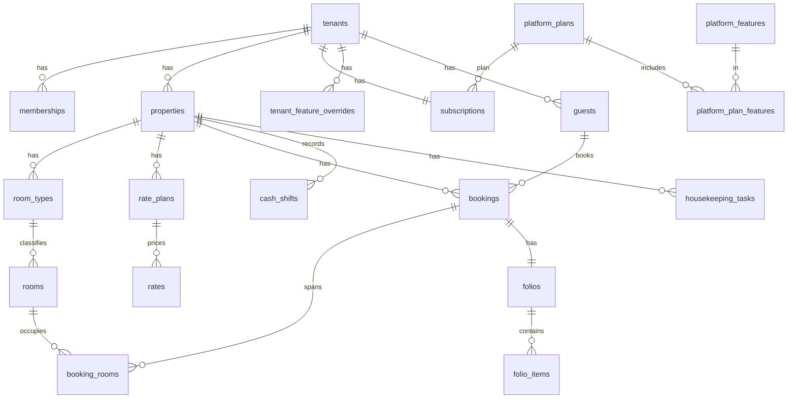

# Data model

The authoritative description of tables, helper functions, triggers and the RLS pattern. The schema ships as git-tracked migrations in `supabase/migrations/` (applied through the Supabase MCP `apply_migration`, mirrored here). This document is the design; the migrations are the implementation. Regression suites in `supabase/tests/` must pass after every migration.

**Applied migrations** (project `hotel-digital`, ref `wdwvnhqtzeivdylhtwxq`, ap-south-1):

| File | What |
|---|---|
| `20261006230000_platform_core.sql` | tenancy, feature catalog & plans, subscriptions & billing, data-only customization, audit, RLS helpers, seed |
| `20261006230100_operational_core.sql` | rooms, rates, guests, bookings (+ no-double-book), folios with stored totals, cash shifts, housekeeping |
| `20261006230200_rls_require_membership.sql` | tenant reads also require a live membership (defense in depth); tenant picker via membership |
| `20261006230300_harden_functions.sql` | pinned `search_path`; function EXECUTE privileges |
| `20261006230400_fix_fill_search_path.sql` | pinned `search_path` on the fill triggers |
| `20261007000000_set_active_tenant.sql` | `set_active_tenant(slug)` — membership-checked stamping of `app_metadata.active_tenant` on the caller's own `auth.users` row (the client then refreshes its JWT); `my_memberships()` for the tenant picker |
| `20261007003000_booking_actions.sql` | **SECURITY INVOKER** front-desk actions (RLS applies as the caller): `create_booking()` — optional new guest, number from `next_booking_no()` (`tenant_settings.booking_prefix` + series), room assignment under the EXCLUDE constraint, room charge auto-posted; `set_booking_status()` — allowed transitions only, check-out blocked while balance due, then folio closed + room dirty. Suite: `supabase/tests/booking_actions.sql` |
| `20261007010000_early_checkout_release.sql` | **Early departure releases the room:** on check-out before the planned date, `check_out` on the booking and its room assignment becomes today, so the EXCLUDE constraint frees the remaining nights. Same-day departures become zero-night rows (empty range never collides); the date checks relax to `check_out >= check_in` (`create_booking()` still requires ≥ 1 night). The app's free-room filter mirrors the EXCLUDE predicate (anything not cancelled / no-show blocks) |
| `20261007020000_booking_management.sql` | **Payments, balances and edits:** `folio_item_kind` gains `discount` (reduces charges) and `refund` (reduces payments) — `total_charges = charges − discounts`, `total_payments = payments − refunds`, `balance` = their difference; a method is required for exactly payments and refunds. `create_booking()` takes an optional advance payment (`p_deposit`, `p_deposit_method`) posted as "Advance payment". New SECURITY INVOKER `update_booking()` — move room / change dates, rate, adults, source, notes on confirmed or in-house stays; the EXCLUDE constraint re-validates the move; the auto-posted room charge follows nights × rate while the folio is open; check-in locked once in-house; closed bookings immutable |
| `20261007030000_business_date_counters.sql` | **Release A (ADR 0006), part 1 — hotel day, counters, property settings.** `property_today(property_id)` = today in the property's timezone (Supabase runs in UTC); `property_counters` + `next_doc_no(property, kind)` give atomic booking / receipt / folio numbers with prefixes from `tenant_settings` (validated by trigger); properties gain `check_in_time`, `check_out_time`, `phone`, `email`, tax settings (`tax_name`, `tax_rate_pct`, `tax_mode` none \| exclusive \| inclusive, `tax_applies_to` room \| all), `ntn`, `strn`, `require_id_at_check_in`, `early_departure_policy` (release \| charge_full), `is_active`. Error codes in class `HD` documented in the file header |
| `20261007031000_folio_integrity.sql` | **Part 2 — append-only folio.** Items gain `category`, `source`, `service_date`, `business_date`, `tax_pkr`, `receipt_no`, `cash_shift_id`, `booking_room_id`, `voided_at/voided_by/void_reason`, `reverses_item_id`; `folio_items_prepare` stamps who/when/hotel day, computes tax from the property settings, numbers payments and links them to the open cash shift; `folio_items_guard` makes posted items immutable (no deletes, only voids); `recompute_folio` locks the folio row and ignores voided rows, maintaining `total_tax`; lump-sum room charges in open folios converted to per-night rows; folios get `folio_no`; RPCs `void_folio_item` (owner/manager/accounts), `reopen_folio` (owner/manager), `close_folio`; folios read-only for the API role, items insert-only |
| `20261007032000_booking_lifecycle.sql` | **Part 3 — lifecycle in the database.** `bookings_guard` (BEFORE INSERT/UPDATE) enforces transitions (`booking_transition_allowed`, owner/manager-only corrections), the check-in window, guest ID requirement, out-of-order rooms, early departure (void unstayed nights per policy), late departure (post extra nights), cancel/no-show voids, balance-due block with owner/manager override (`checkout_override_reason`), credit block; `bookings_effects` (AFTER UPDATE) syncs `booking_rooms`, closes settled folios, dirties the room. Stamps `checked_in_at`, `checked_out_at`, `cancelled_at/by`, `cancellation_reason`, `no_show_at`, `updated_by`. Helpers `_assign_room`, `_post_room_nights`, `_void_room_nights` (SECURITY DEFINER, permission-checked) are the only writers of `booking_rooms` and room charges. `create_booking` gains `p_children`, `p_check_in_now`, guest ID and nationality parameters and reuses a returning guest by phone + name; `set_booking_status` gains `p_reason`; RPCs lock the booking row. Guests gain `id_type`, `id_number`, `id_expiry`, `address` with CNIC and E.164 phone checks; `booking_rooms` unique per booking (v1) |
| `20261007033000_access_hardening.sql` | **Part 4 — access hardening.** Composite FKs `(tenant_id, …)` / `(property_id, …)` on every leaf reference; `ON DELETE RESTRICT` through properties → bookings → folios → items; no DELETE privilege for tenant roles on operational/financial tables; all tenant-table policies regenerated as one SELECT + INSERT / UPDATE (/ DELETE) with helper calls wrapped in `(select …)`; platform admin policies split by command; `memberships_guard` (owner role only granted by owners, no self-change, last owner kept); `tenant_access_level()` honours `tenants.is_active`; `my_tenant_access()` / `tenant_has_feature()` require membership; `properties_cap_guard` enforces the plan's property count; signup form CHECKs and no admin fields; `normalize_phone()` + `guests_prepare` (E.164, CNIC dashes); audit JSON strips identity documents, `platform_audit_row` on platform tables; `search_path = public, pg_temp` everywhere; indexes for FKs, calendar range (GiST), guest search (trigram) |
| `20261007034000_operations.sql` | **Part 5 — operations.** Cash shifts are RPC-only: `open_cash_shift` (one open per property, float), `close_cash_shift` (declared vs `expected` computed from linked payments), `confirm_cash_shift` (next shift or manager; discrepancy); `room_status_history` by trigger, housekeeping role limited to status changes, task due dates default to the hotel day; `daily_report(property, date)`; `provision_tenant` creates the default rate plan and aligns the trial period |
| `20261007035000_billing_job.sql` | **ADR 0004 job.** `run_billing_transitions()` (trial → past_due → read_only → suspended → cancelled) scheduled by `pg_cron` daily at 06:00 PKT (`0 1 * * *` UTC) |

## Conventions
- **Tenant-owned tables** carry `tenant_id uuid not null`. **Operational tables** also carry `property_id`.
- **Platform tables** are prefixed `platform_`. Tenant/operational tables are plain (`bookings`, `rooms`).
- Every tenant table has RLS enabled, an `updated_at` trigger, and the generic audit trigger (writes to `audit_log`).
- **Child rows never trust client input for tenancy:** `booking_rooms` and `folios` take `tenant_id`/`property_id` from their booking, `folio_items` from their folio, via `BEFORE INSERT` fill triggers.
- Money is `numeric(12,2)` PKR. Hotel-local dates are `date`; instants are `timestamptz`. Phones stored canonical E.164 (`+92…`), normalised by `normalize_phone()` on write.
- **The hotel day** is `property_today(property_id)` (today in the property's timezone) — never `current_date`, which is UTC on Supabase. Folio items and cash shifts carry `business_date`.
- **The folio is append-only** (ADR 0006): items are inserted, never updated or deleted; corrections are voids with a reason; totals are maintained by trigger and exclude voided rows; folios are read-only for the API role.
- **Room charges are one row per night** (`category = 'room'`, `source = 'auto'`, `service_date`), posted and voided only by `_post_room_nights()` / `_void_room_nights()`.
- **Document numbers** come from `property_counters` via `next_doc_no()` (booking, receipt, folio) with prefixes from `tenant_settings`.
- **Leaf references are tenant-safe**: composite foreign keys `(tenant_id, …)` / `(property_id, …)` make it impossible to point at another tenant's room, guest, room type or rate plan.
- **Nothing deletes through money**: tenant roles have no DELETE on operational or financial tables; properties → bookings → folios → items are `ON DELETE RESTRICT`.
- Primary keys are `uuid default gen_random_uuid()`; append-only logs use `bigint identity`.
- Enums are Postgres `enum` types mirrored by the constants in `packages/shared`.
- Functions raise stable `SQLSTATE` codes (class `HD`, see the header of `20261007030000_business_date_counters.sql`); the app maps codes, never message text.

## Relationship overview


## Helper functions (RLS reads them; all `stable`, `search_path` pinned)
| Function | Returns | Purpose |
|---|---|---|
| `current_tenant_id()` | `uuid` | `auth.jwt() -> 'app_metadata' ->> 'active_tenant'` — the active tenant, set only by a trusted edge function |
| `current_role_in_tenant()` | `tenant_role` | caller's role in the active tenant; **null when not a member** |
| `is_platform_admin()` | `bool` | caller is in `platform_admins` |
| `tenant_access_level()` | `text` | `full` \| `read_only` \| `none` from the subscription; **null (deny) when no subscription exists** |
| `tenant_has_feature(key)` | `bool` | latest in-window override wins, else plan membership, else false |
| `my_tenant_access()` | table | status + access level for the app shell, readable even when suspended |
| `provision_tenant(name, slug, property, city, plan_key, owner_user)` | `uuid` | operator RPC: tenant + property + subscription + settings + branding (+ owner membership); writes `platform_audit_log`; raises unless the caller is a platform admin |

Access-level mapping: `trialing`/`active`/`past_due` → `full`; `read_only` → `read_only`; `suspended`/`cancelled` → `none`.

## Platform tables
- `platform_admins` (user_id → auth.users, name, role `owner|staff`)
- `platform_features` (**key** PK, name, description, is_core, is_addon) — key format `^(core|addon)\.…`
- `platform_plans` (id, key, name, price_pkr default 0, interval, max_properties, trial_days, is_active)
- `platform_plan_features` (plan_id, feature_key) — PK(plan_id, feature_key)
- `platform_signup_requests` (hotel_name, city, rooms, contact_name, email, phone, status `pending|approved|rejected`, reviewed_by, reviewed_at, tenant_id nullable) — the public form may insert `pending` rows only
- `platform_audit_log` (actor_admin, action, target_table, target_id, before, after, at)
- `platform_message_templates` (key, channel `whatsapp|email`, body), `platform_document_templates` (key, body) — defaults when a tenant has no override

## Tenant tables (`tenant_id`)
- `tenants` (id, name, **slug** unique, custom_domain unique nullable, is_active)
- `memberships` (tenant_id, user_id → auth.users, role) — unique(tenant_id, user_id)
- `properties` (tenant_id, name, timezone `Asia/Karachi`, currency `PKR`, address, city, phone, email, wubook_lcode nullable, `check_in_time` 14:00, `check_out_time` 12:00, tax settings `tax_name` / `tax_rate_pct` / `tax_mode` none\|exclusive\|inclusive / `tax_applies_to` room\|all, `ntn`, `strn`, `require_id_at_check_in` true, `early_departure_policy` release\|charge_full, `is_active`)
- `property_counters` (property_id, kind booking\|receipt\|folio, last_no) — written only by `next_doc_no()`
- `subscriptions` (tenant_id PK, plan_id, status, trial_ends_at, current_period_start/end, grace_days 7, read_only_days 7, suspended_at, cancelled_at, notes)
- `subscription_events` (tenant_id, from_status, to_status, reason, actor, at)
- `tenant_feature_overrides` (tenant_id, feature_key, enabled, starts_at, ends_at, reason, granted_by)
- `invoices` (tenant_id, invoice_no unique, period_start/end, amount_pkr, status `draft|sent|paid|void`, due_date) + `invoice_items`
- `payments` (tenant_id, invoice_id nullable, amount_pkr > 0, method `bank_transfer|raast|jazzcash|easypaisa|cash`, reference, received_at, recorded_by)
- `tenant_settings` (tenant_id PK, settings jsonb, schema_version) — validated against the versioned schema in `packages/shared`
- `tenant_branding` (tenant_id PK, logo_url, primary_color, legal_name, address, ntn, strn)
- `custom_field_definitions` (tenant_id, entity `guest|booking`, key, label, type, required, options) — writes gated by `addon.custom_fields`
- `message_templates` / `document_templates` — per-tenant overrides of the platform defaults
- `audit_log` (tenant_id, actor_user, table_name, row_id, action, before, after, at) — written only by the `audit_row()` trigger; actor = `app.actor_user` (set by edge functions) else `auth.uid()`

## Operational tables (`tenant_id` + `property_id`)
- `room_types` (property_id, name, bed_config, size_sqm, base_occupancy, max_occupancy, **base_rate_pkr**, sort_order) — unique(property_id, name)
- `rooms` (property_id, room_type_id, label, floor, housekeeping_status `clean|dirty|inspected|out_of_order`, is_active) — unique(property_id, label)
- `rate_plans` (property_id, name, is_default) — exactly one default per property (partial unique index); a **non-default plan needs `addon.rate_plans`**
- `rates` (rate_plan_id, room_type_id, date, price_pkr) — per-date overrides; **effective price = `coalesce(rates.price_pkr, room_types.base_rate_pkr)`**
- `guests` (tenant_id, name, phone E.164, email, nationality, `id_type` cnic\|nicop\|poc\|passport\|other, `id_number` (CNIC `XXXXX-XXXXXXX-X`), `id_expiry`, `address`, custom_fields jsonb, notes; legacy `cnic`/`passport` until the app has moved) — tenant-scoped, shared across a tenant's properties; `guests_prepare` normalises phone / CNIC on write
- `bookings` (property_id, guest_id, booking_no unique per property, status `confirmed|checked_in|checked_out|cancelled|no_show`, source `walk_in|phone|whatsapp|ota|direct`, check_in, check_out, adults, children, ota_ref, notes, custom_fields, `created_by`, `updated_by`, `checked_in_at`, `checked_out_at`, `cancelled_at`, `cancelled_by`, `cancellation_reason`, `no_show_at`, `checkout_override_reason`, `checkout_override_by`) — check(check_out >= check_in; new bookings need ≥ 1 night); **every booking gets a folio** (AFTER INSERT trigger); lifecycle enforced by `bookings_guard` / `bookings_effects`
- `booking_rooms` (booking_id unique in v1, room_id, room_type_id, check_in, check_out, status, nightly_rate_pkr, nightly jsonb) — carries the no-double-book constraint; written only by `_assign_room()` and the lifecycle trigger
- `folios` (booking_id unique, `folio_no`, status `open|closed`, **total_charges, total_tax, total_payments, balance** — stored totals are the truth, maintained by the locked recompute trigger over non-voided items: `balance = charges + tax − payments`, charges net of discounts, payments net of refunds; `reopened_at/by`, `reopen_reason`) — read-only for the API role
- `folio_items` (folio_id, kind `charge|payment|discount|refund`, `category` room\|food\|laundry\|minibar\|extra\|fee\|adjustment\|deposit\|settlement\|other, `source` manual\|auto\|system, description, amount_pkr > 0 (net), `tax_pkr`, method (payments and refunds only), reference, `receipt_no` (payments/refunds), `service_date` (room nights), `business_date`, `cash_shift_id`, `booking_room_id`, posted_at/posted_by (server-stamped), `voided_at/voided_by/void_reason`, `reverses_item_id`) — insert-only; rejected when the folio is closed
- `cash_shifts` (property_id, shift_date (hotel day), status `open|handed_over|confirmed`, `opening_float`, opened_by/at, declared jsonb, `expected` jsonb, closed_by/at, confirmed jsonb, confirmed_by/at, discrepancy jsonb, notes) — RPC-only; one open shift per property
- `room_status_history` (room_id, from_status, to_status, changed_by, changed_at, note) — written by trigger
- `housekeeping_tasks` (property_id, room_id, status `pending|in_progress|done`, assigned_to, note, due_date defaults to the hotel day)

### Add-on tables (Phase 4, not yet created)
- `addon.channel_wubook` — `cm_connections`, `cm_room_mappings`, `cm_rate_mappings`, `cm_availability_queue`, `cm_sync_log`, `cm_reservations`; ported from Hamsun with `tenant_id`/`property_id` added (ADR 0005).
- `addon.booking_engine` — `booking_engine_settings` + public SECURITY DEFINER availability/quote RPCs; direct bookings insert into `bookings` with `source = 'direct'`.

## No-double-book constraint (as implemented)
```sql
constraint booking_rooms_no_overlap exclude using gist (
  room_id with =,
  daterange(check_in, check_out, '[)') with &&      -- half-open: the check-out day is free
) where (status not in ('cancelled', 'no_show'))
```
Two live stays can never overlap in one room, under any concurrency. Verified by the operational suite: an overlapping stay is rejected, same-day turnover is allowed, and cancelled / no-show stays release the room.

## RLS pattern (as implemented, every tenant table)
```sql
-- READ: own tenant, subscription not suspended, tenant active, and a live membership
create policy bookings_read on public.bookings for select to authenticated
  using (((tenant_id = (select public.current_tenant_id()))
          and ((select public.tenant_access_level()) <> 'none')
          and ((select public.current_role_in_tenant()) is not null))
         or (select public.is_platform_admin()));

-- WRITE: one policy per command (insert / update / optional delete); own tenant, full access, write role
create policy bookings_insert on public.bookings for insert to authenticated
  with check (((tenant_id = (select public.current_tenant_id()))
               and ((select public.tenant_access_level()) = 'full')
               and ((select public.current_role_in_tenant()) in ('owner','manager','front_desk')))
              or (select public.is_platform_admin()));
```
Helper calls are wrapped in `(select …)` so Postgres evaluates them once per statement, not per row. The membership check on reads closes the window where a revoked member still holds an unexpired JWT. Write role sets (generated by the policy spec in `20261007033000_access_hardening.sql`):

| Tables | Insert / update roles | Delete |
|---|---|---|
| properties, room_types, tenant_settings, tenant_branding | owner, manager | no |
| rate_plans (non-default needs `addon.rate_plans`), rates, custom_field_definitions (`addon.custom_fields`), message_templates, document_templates | owner, manager | yes |
| rooms (housekeeping may only change the status) | owner, manager, front_desk, housekeeping | no |
| housekeeping_tasks | owner, manager, front_desk, housekeeping | yes |
| guests, bookings | owner, manager, front_desk | no |
| folio_items | insert only: owner, manager, front_desk, accounts | no |
| booking_rooms, folios, cash_shifts, room_status_history, property_counters | API read-only; written by triggers / RPCs | no |
| memberships (guarded) | owner, manager | yes |
| subscriptions, events, overrides, invoices, payments, platform catalogue | platform admins only (tenant members read) | admins |
| audit_log | no direct writes; read by owner, manager, accounts | no |

Table privileges back the policies: `DELETE` is revoked from `authenticated` on operational and financial tables, and `INSERT/UPDATE` on the trigger-maintained ones. Special cases: `memberships` read also allows `user_id = auth.uid()` (tenant picker); `tenants` read also allows any tenant the user is a member of; `platform_signup_requests` allows `anon` inserts of `pending` rows without admin fields; the `read_only` role has no write policy anywhere.

## Lifecycle, folio and operations functions (ADR 0006)
| Function | Security | Purpose |
|---|---|---|
| `property_today(property_id)` | definer | today in the property's timezone |
| `next_doc_no(property_id, kind)` / `next_booking_no()` | definer (writer roles) | atomic document numbers |
| `create_booking(…, p_deposit, p_deposit_method, p_children, p_check_in_now, p_guest_id_type, p_guest_id_number, p_guest_nationality)` | invoker | create (and optionally check in) a booking; reuses a returning guest by phone + name |
| `update_booking(…, p_children)` | invoker | move room / change dates, rate, adults, children, source, notes; re-posts nights |
| `set_booking_status(booking, status, reason)` | invoker | status change; the guard trigger applies every rule |
| `void_folio_item(item, reason)` | definer (owner, manager, accounts) | void an item while the folio is open |
| `reopen_folio(folio, reason)` / `close_folio(folio)` | definer (owner/manager; close also accounts) | corrections after check-out; close needs balance 0 |
| `open_cash_shift` / `close_cash_shift` / `confirm_cash_shift` | definer (cashier roles) | shift handover with expected vs declared amounts |
| `daily_report(property, date)` | invoker | arrivals, departures, in-house, rooms sold, revenue, tax, payments by method, outstanding, shifts |
| `run_billing_transitions()` | definer (service_role; pg_cron) | ADR 0004 state machine |
| `_assign_room`, `_post_room_nights`, `_void_room_nights`, `_assert_booking_writer`, `_assert_cashier`, `_shift_expected`, `_validate_method_amounts` | definer, permission-checked | internal helpers used by the RPCs and triggers |

## Function privileges (advisor-driven)
- **Trigger functions** (`audit_row`, `set_updated_at`, the fill triggers, `bookings_create_folio`, `recompute_folio`): EXECUTE revoked from `public`, `anon`, `authenticated`. Triggers fire regardless of EXECUTE — verified by the suites with revoked privileges.
- **RLS helpers and RPCs**: revoked from `public`/`anon`, granted to `authenticated` and `service_role`. Policy expressions run as the querying role, so `authenticated` must be able to call them; they only reveal the caller's own role/access/features. `provision_tenant` raises unless the caller is a platform admin.
- Accepted advisor warnings: lint 0029 on the six helpers above (intentional). Remaining item is an Auth dashboard toggle (leaked-password protection), not SQL.

## Test suites (`supabase/tests/`)
Three self-contained suites (72 checks) build their own fixtures — two tenants, one property each, rooms, a guest and one user per role — inside a transaction and roll everything back, so they do not depend on the demo seed or the calendar date. See `supabase/tests/README.md`.
- `isolation.sql` — 37 checks: visibility by claim, cross-tenant writes, all six roles, no-claim picker, platform admin, forged claims, features and overrides, read-only / suspended / deactivated tenants, composite foreign keys, membership rules, plan limits, no deletes, trigger functions not callable, public signup form.
- `bookings_folio.sql` — 26 checks: numbering, nightly rows, receipts, attribution, normalisation, no double booking, deposits, out-of-order rooms, check-in rules, walk-in + early departure, balance-due guard and manager override, credit guard, cancel / no-show / reinstate, edits, direct writes, folio immutability, void, reopen / close, late departure, tax.
- `operations.sql` — 9 checks: cash shifts, housekeeping history, daily report, billing job, provisioning.

How they work: run as `postgres`; impersonate users with `set_config('request.jwt.claims', …)` + `set role authenticated|anon`; every write is rolled back. Run via the Supabase MCP `execute_sql` or `psql`. **All checks must pass after every migration.**
