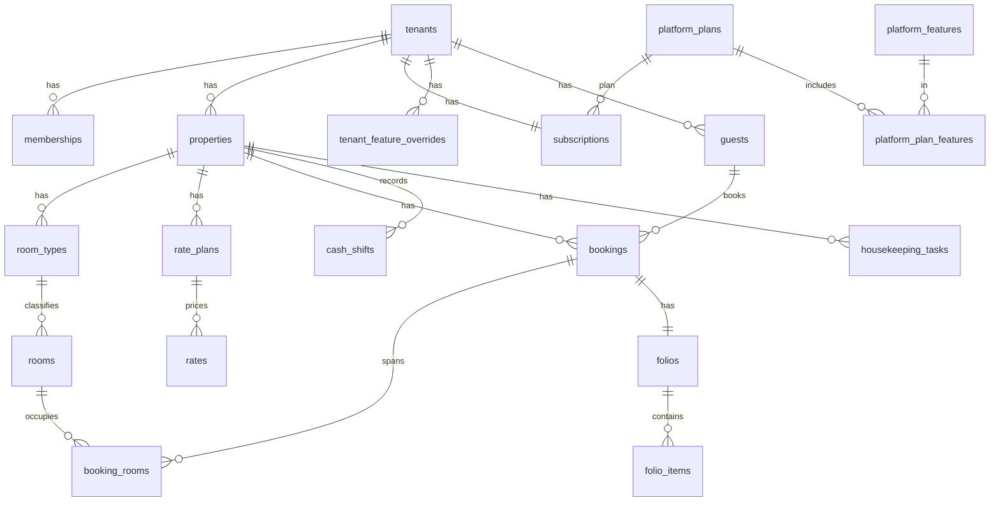

# Data model

The authoritative description of tables, helper functions, triggers and the RLS pattern. The schema ships as git-tracked migrations in `supabase/migrations/` (applied through the Supabase MCP `apply_migration`, mirrored here). This document is the design; the migrations are the implementation. Regression suites in `supabase/tests/` must pass after every migration.

**Applied migrations** (project `hotel-digital`, ref `wdwvnhqtzeivdylhtwxq`, ap-south-1):

| File | What |
|---|---|
| `20261006230000_platform_core.sql` | tenancy, feature catalog & plans, subscriptions & billing, data-only customization, audit, RLS helpers, seed |
| `20261006230100_operational_core.sql` | rooms, rates, guests, bookings (+ no-double-book), folios with stored totals, cash shifts, housekeeping |
| `20261006230200_rls_require_membership.sql` | tenant reads also require a live membership (defense in depth); tenant picker via membership |
| `20261006230300_harden_functions.sql` | pinned `search_path`; function EXECUTE privileges |
| `20261006230400_fix_fill_search_path.sql` | pinned `search_path` on the fill triggers |
| `20261007000000_set_active_tenant.sql` | `set_active_tenant(slug)` — membership-checked stamping of `app_metadata.active_tenant` on the caller's own `auth.users` row (the client then refreshes its JWT); `my_memberships()` for the tenant picker |
| `20261007003000_booking_actions.sql` | **SECURITY INVOKER** front-desk actions (RLS applies as the caller): `create_booking()` — optional new guest, number from `next_booking_no()` (`tenant_settings.booking_prefix` + series), room assignment under the EXCLUDE constraint, room charge auto-posted; `set_booking_status()` — allowed transitions only, check-out blocked while balance due, then folio closed + room dirty. Suite: `supabase/tests/booking_actions.sql` |

## Conventions
- **Tenant-owned tables** carry `tenant_id uuid not null`. **Operational tables** also carry `property_id`.
- **Platform tables** are prefixed `platform_`. Tenant/operational tables are plain (`bookings`, `rooms`).
- Every tenant table has RLS enabled, an `updated_at` trigger, and the generic audit trigger (writes to `audit_log`).
- **Child rows never trust client input for tenancy:** `booking_rooms` and `folios` take `tenant_id`/`property_id` from their booking, `folio_items` from their folio, via `BEFORE INSERT` fill triggers.
- Money is `numeric(12,2)` PKR. Hotel-local dates are `date`; instants are `timestamptz`. Phones stored canonical `+92…`.
- Primary keys are `uuid default gen_random_uuid()`; append-only logs use `bigint identity`.
- Enums are Postgres `enum` types mirrored by the constants in `packages/shared`.

## Relationship overview


## Helper functions (RLS reads them; all `stable`, `search_path` pinned)
| Function | Returns | Purpose |
|---|---|---|
| `current_tenant_id()` | `uuid` | `auth.jwt() -> 'app_metadata' ->> 'active_tenant'` — the active tenant, set only by a trusted edge function |
| `current_role_in_tenant()` | `tenant_role` | caller's role in the active tenant; **null when not a member** |
| `is_platform_admin()` | `bool` | caller is in `platform_admins` |
| `tenant_access_level()` | `text` | `full` \| `read_only` \| `none` from the subscription; **null (deny) when no subscription exists** |
| `tenant_has_feature(key)` | `bool` | latest in-window override wins, else plan membership, else false |
| `my_tenant_access()` | table | status + access level for the app shell, readable even when suspended |
| `provision_tenant(name, slug, property, city, plan_key, owner_user)` | `uuid` | operator RPC: tenant + property + subscription + settings + branding (+ owner membership); writes `platform_audit_log`; raises unless the caller is a platform admin |

Access-level mapping: `trialing`/`active`/`past_due` → `full`; `read_only` → `read_only`; `suspended`/`cancelled` → `none`.

## Platform tables
- `platform_admins` (user_id → auth.users, name, role `owner|staff`)
- `platform_features` (**key** PK, name, description, is_core, is_addon) — key format `^(core|addon)\.…`
- `platform_plans` (id, key, name, price_pkr default 0, interval, max_properties, trial_days, is_active)
- `platform_plan_features` (plan_id, feature_key) — PK(plan_id, feature_key)
- `platform_signup_requests` (hotel_name, city, rooms, contact_name, email, phone, status `pending|approved|rejected`, reviewed_by, reviewed_at, tenant_id nullable) — the public form may insert `pending` rows only
- `platform_audit_log` (actor_admin, action, target_table, target_id, before, after, at)
- `platform_message_templates` (key, channel `whatsapp|email`, body), `platform_document_templates` (key, body) — defaults when a tenant has no override

## Tenant tables (`tenant_id`)
- `tenants` (id, name, **slug** unique, custom_domain unique nullable, is_active)
- `memberships` (tenant_id, user_id → auth.users, role) — unique(tenant_id, user_id)
- `properties` (tenant_id, name, timezone `Asia/Karachi`, currency `PKR`, address, city, wubook_lcode nullable)
- `subscriptions` (tenant_id PK, plan_id, status, trial_ends_at, current_period_start/end, grace_days 7, read_only_days 7, suspended_at, cancelled_at, notes)
- `subscription_events` (tenant_id, from_status, to_status, reason, actor, at)
- `tenant_feature_overrides` (tenant_id, feature_key, enabled, starts_at, ends_at, reason, granted_by)
- `invoices` (tenant_id, invoice_no unique, period_start/end, amount_pkr, status `draft|sent|paid|void`, due_date) + `invoice_items`
- `payments` (tenant_id, invoice_id nullable, amount_pkr > 0, method `bank_transfer|raast|jazzcash|easypaisa|cash`, reference, received_at, recorded_by)
- `tenant_settings` (tenant_id PK, settings jsonb, schema_version) — validated against the versioned schema in `packages/shared`
- `tenant_branding` (tenant_id PK, logo_url, primary_color, legal_name, address, ntn, strn)
- `custom_field_definitions` (tenant_id, entity `guest|booking`, key, label, type, required, options) — writes gated by `addon.custom_fields`
- `message_templates` / `document_templates` — per-tenant overrides of the platform defaults
- `audit_log` (tenant_id, actor_user, table_name, row_id, action, before, after, at) — written only by the `audit_row()` trigger; actor = `app.actor_user` (set by edge functions) else `auth.uid()`

## Operational tables (`tenant_id` + `property_id`)
- `room_types` (property_id, name, bed_config, size_sqm, base_occupancy, max_occupancy, **base_rate_pkr**, sort_order) — unique(property_id, name)
- `rooms` (property_id, room_type_id, label, floor, housekeeping_status `clean|dirty|inspected|out_of_order`, is_active) — unique(property_id, label)
- `rate_plans` (property_id, name, is_default) — exactly one default per property (partial unique index); a **non-default plan needs `addon.rate_plans`**
- `rates` (rate_plan_id, room_type_id, date, price_pkr) — per-date overrides; **effective price = `coalesce(rates.price_pkr, room_types.base_rate_pkr)`**
- `guests` (tenant_id, name, phone, email, cnic, passport, nationality, custom_fields jsonb, notes) — tenant-scoped, shared across a tenant's properties
- `bookings` (property_id, guest_id, booking_no unique per property, status `confirmed|checked_in|checked_out|cancelled|no_show`, source `walk_in|phone|whatsapp|ota|direct`, check_in, check_out, adults, children, ota_ref, notes, custom_fields) — check(check_out > check_in); **every booking gets a folio** (AFTER INSERT trigger)
- `booking_rooms` (booking_id, room_id, room_type_id, check_in, check_out, status, nightly_rate_pkr, nightly jsonb) — carries the no-double-book constraint
- `folios` (booking_id unique, status `open|closed`, **total_charges, total_payments, balance** — stored totals are the truth, maintained by the recompute trigger)
- `folio_items` (folio_id, kind `charge|payment`, description, amount_pkr > 0, method (payments only), reference, posted_at, posted_by) — rejected when the folio is closed
- `cash_shifts` (property_id, shift_date, status `open|handed_over|confirmed`, opened_by/at, declared jsonb, closed_by/at, confirmed jsonb, confirmed_by/at, discrepancy jsonb, notes)
- `housekeeping_tasks` (property_id, room_id, status `pending|in_progress|done`, assigned_to, note, due_date)

### Add-on tables (Phase 4, not yet created)
- `addon.channel_wubook` — `cm_connections`, `cm_room_mappings`, `cm_rate_mappings`, `cm_availability_queue`, `cm_sync_log`, `cm_reservations`; ported from Hamsun with `tenant_id`/`property_id` added (ADR 0005).
- `addon.booking_engine` — `booking_engine_settings` + public SECURITY DEFINER availability/quote RPCs; direct bookings insert into `bookings` with `source = 'direct'`.

## No-double-book constraint (as implemented)
```sql
constraint booking_rooms_no_overlap exclude using gist (
  room_id with =,
  daterange(check_in, check_out, '[)') with &&      -- half-open: the check-out day is free
) where (status not in ('cancelled', 'no_show'))
```
Two live stays can never overlap in one room, under any concurrency. Verified by the operational suite: an overlapping stay is rejected, same-day turnover is allowed, and cancelled / no-show stays release the room.

## RLS pattern (as implemented, every tenant table)
```sql
-- READ: own tenant, subscription not suspended, and a live membership
create policy bookings_read on public.bookings for select to authenticated
  using ((tenant_id = public.current_tenant_id()
          and public.tenant_access_level() <> 'none'
          and public.current_role_in_tenant() is not null)
         or public.is_platform_admin());

-- WRITE: own tenant, full access, and a role allowed to write this table
create policy bookings_write on public.bookings for all to authenticated
  using (... and public.tenant_access_level() = 'full'
             and public.current_role_in_tenant() in ('owner','manager','front_desk')
         or public.is_platform_admin())
  with check (same);
```
The membership check on reads closes the window where a revoked member still holds an unexpired JWT. Write role sets:

| Tables | Write roles |
|---|---|
| properties, room_types, rate_plans, rates, tenant_settings, tenant_branding, templates, custom_field_definitions | owner, manager |
| rooms, housekeeping_tasks | owner, manager, front_desk, housekeeping |
| guests, bookings, booking_rooms | owner, manager, front_desk |
| folios, folio_items, cash_shifts | owner, manager, front_desk, accounts |
| subscriptions, events, overrides, invoices, payments | platform admins only (tenant members read) |
| audit_log | no direct writes; read by owner, manager, accounts |

Special cases: `memberships` read also allows `user_id = auth.uid()` (tenant picker); `tenants` read also allows any tenant the user is a member of; `platform_signup_requests` allows `anon` inserts of `pending` rows only; `read_only` role has no write policy anywhere.

## Function privileges (advisor-driven)
- **Trigger functions** (`audit_row`, `set_updated_at`, the fill triggers, `bookings_create_folio`, `recompute_folio`): EXECUTE revoked from `public`, `anon`, `authenticated`. Triggers fire regardless of EXECUTE — verified by the suites with revoked privileges.
- **RLS helpers and RPCs**: revoked from `public`/`anon`, granted to `authenticated` and `service_role`. Policy expressions run as the querying role, so `authenticated` must be able to call them; they only reveal the caller's own role/access/features. `provision_tenant` raises unless the caller is a platform admin.
- Accepted advisor warnings: lint 0029 on the six helpers above (intentional). Remaining item is an Auth dashboard toggle (leaked-password protection), not SQL.

## Test suites (`supabase/tests/`)
- `isolation_platform.sql` — 15 checks: A↔B visibility by claim, cross-tenant insert/update denial, owner vs front_desk roles, no-claim picker behaviour, platform-admin visibility, forged claim without membership, feature flags by plan, `read_only` / `suspended` gating, anon signup insert-but-not-read.
- `isolation_operational.sql` — 11 checks: bookings/rooms visibility, the three no-double-book cases, folio recompute under RLS, closed-folio rejection, cross-tenant booking denial, rate-plan add-on gate, front_desk role limits, forged claim.

How they work: run as `postgres`; impersonate users with `set_config('request.jwt.claims', …)` + `set role authenticated|anon`; every write is rolled back through a subtransaction. Run via the Supabase MCP `execute_sql` or `psql`. **All checks must pass after every migration.**
