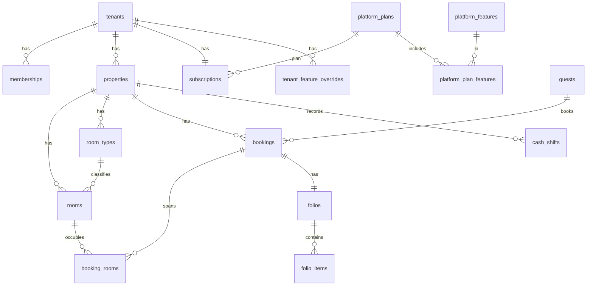

# Data model

The authoritative description of tables, keys, helper functions, and the RLS pattern. Schema is delivered as git-tracked migrations in `supabase/migrations/` (Phase 1 onward). This document is the design; migrations are the implementation.

## Conventions
- **Tenant-owned tables** carry `tenant_id uuid not null`. **Operational tables** also carry `property_id uuid not null`.
- **Platform tables** are prefixed `platform_`. Tenant/operational tables are plain (`bookings`, `rooms`).
- Every tenant table has: RLS enabled, an `updated_at` trigger, and the generic audit trigger (writes to `audit_log`).
- Money is `numeric(12,2)` in PKR. Hotel-local dates are `date`; instants are `timestamptz`. Phones stored canonical `+92…`.
- Primary keys are `uuid default gen_random_uuid()` unless noted.
- Enums are Postgres `check` constraints or `enum` types; feature keys are mirrored by a check constraint against the shared constant.

## Relationship overview


## Helper functions (SECURITY DEFINER where noted)
| Function | Returns | Purpose |
|---|---|---|
| `current_tenant_id()` | `uuid` | `(auth.jwt()->'app_metadata'->>'active_tenant')::uuid` — the active tenant from the JWT. |
| `current_role_in_tenant()` | `text` | Role from `memberships` for `(current_tenant_id(), auth.uid())`. |
| `is_platform_admin()` | `bool` | `auth.uid()` present in `platform_admins`. |
| `tenant_access_level()` | `text` | `full` \| `read_only` \| `none` from the tenant's subscription status (see billing.md). |
| `tenant_has_feature(key)` | `bool` | Plan features ± date-filtered overrides for the current tenant (see feature-flags.md). |

Access-level mapping: `trialing`/`active`/`past_due` → `full`; `read_only` → `read_only`; `suspended`/`cancelled` → `none`.

## Platform tables
- `platform_admins` (user_id → auth.users, name, role `owner|staff`, created_at)
- `platform_features` (**key** PK text, name, description, is_core bool, is_addon bool)
- `platform_plans` (id, key, name, price_pkr numeric(12,2) default 0, interval `monthly`, max_properties int default 1, trial_days int default 14, is_active bool)
- `platform_plan_features` (plan_id → platform_plans, feature_key → platform_features) — PK(plan_id, feature_key)
- `platform_signup_requests` (id, hotel_name, city, rooms int, contact_name, email, phone, status `pending|approved|rejected`, created_at, reviewed_by → platform_admins, reviewed_at, tenant_id nullable once approved)
- `platform_audit_log` (id, actor_admin → platform_admins, action, target_table, target_id, before jsonb, after jsonb, at timestamptz)
- `platform_message_templates` / `platform_document_templates` (key, channel/kind, body) — defaults used when a tenant has no override

## Tenant tables (`tenant_id`)
- `tenants` (id, name, **slug** unique, custom_domain unique nullable, is_active bool, created_at)
- `memberships` (id, tenant_id, user_id → auth.users, role `owner|manager|front_desk|housekeeping|accounts|read_only`, created_at) — unique(tenant_id, user_id)
- `properties` (id, tenant_id, name, timezone default `Asia/Karachi`, currency default `PKR`, address, wubook_lcode nullable, created_at)
- `subscriptions` (tenant_id unique, plan_id → platform_plans, status, trial_ends_at, current_period_start, current_period_end, grace_days int default 7, read_only_days int default 7, suspended_at, cancelled_at, notes) — see ADR 0004
- `subscription_events` (id, tenant_id, from_status, to_status, reason, actor, at)
- `tenant_feature_overrides` (id, tenant_id, feature_key → platform_features, enabled bool, starts_at, ends_at, reason, granted_by → platform_admins)
- `invoices` (id, tenant_id, period_start date, period_end date, amount_pkr, status `draft|sent|paid|void`, due_date date, created_at)
- `invoice_items` (id, invoice_id → invoices, description, amount_pkr)
- `payments` (id, tenant_id, invoice_id nullable, amount_pkr, method `bank_transfer|raast|jazzcash|easypaisa|cash`, reference, received_at, recorded_by → platform_admins)
- `tenant_settings` (tenant_id PK, settings jsonb, schema_version int) — validated vs versioned schema in `packages/shared`
- `tenant_branding` (tenant_id PK, logo_url, primary_color, legal_name, address, ntn, strn)
- `custom_field_definitions` (id, tenant_id, entity `guest|booking`, key, label, type, required bool, options jsonb) — behind `addon.custom_fields`
- `message_templates` / `document_templates` (id, tenant_id, key, channel/kind, body) — override platform defaults
- `audit_log` (id, tenant_id, actor_user, table_name, row_id, action `insert|update|delete`, before jsonb, after jsonb, at)

## Operational tables (`tenant_id` + `property_id`)
- `room_types` (id, tenant_id, property_id, name, base_occupancy int, max_occupancy int)
- `rooms` (id, tenant_id, property_id, room_type_id → room_types, label, housekeeping_status `clean|dirty|inspected|out_of_order` default `clean`)
- `rate_plans` (id, tenant_id, property_id, name, is_default bool) — Basic gets one default plan; multiple behind `addon.rate_plans`
- `rates` (id, tenant_id, property_id, rate_plan_id, room_type_id, date, price_pkr) — unique(rate_plan_id, room_type_id, date)
- `guests` (id, tenant_id, name, phone `+92…`, email, cnic, passport, nationality, custom_fields jsonb, created_at)
- `bookings` (id, tenant_id, property_id, guest_id → guests, status `confirmed|checked_in|checked_out|cancelled|no_show`, source `walk_in|phone|whatsapp|ota|direct`, check_in date, check_out date, booking_no text, ota_ref nullable, custom_fields jsonb, notes, created_at)
- `booking_rooms` (id, booking_id → bookings, room_id → rooms, room_type_id, check_in date, check_out date, status, nightly jsonb) — the no-double-book constraint lives here (below)
- `folios` (id, tenant_id, property_id, booking_id → bookings, status `open|closed`, total_charges numeric(12,2), total_payments numeric(12,2), balance numeric(12,2)) — stored totals are the truth
- `folio_items` (id, folio_id → folios, kind `charge|payment`, description, amount_pkr, method nullable, posted_at, posted_by) — folio totals recomputed in a trigger on write
- `cash_shifts` (id, tenant_id, property_id, shift_date date, opened_by, closed_by, declared jsonb `{method: amount}`, confirmed_by, confirmed jsonb, discrepancy jsonb, status `open|handed_over|confirmed`) — core.cash_handover
- `housekeeping_tasks` (id, tenant_id, property_id, room_id, status `pending|in_progress|done`, assigned_to, note, date) — optional companion to `rooms.housekeeping_status`

### Add-on tables (Phase 4)
- `addon.channel_wubook` — `cm_connections` (tenant_id, property_id, lcode, status), `cm_room_mappings`, `cm_rate_mappings`, `cm_availability_queue`, `cm_sync_log`, `cm_reservations` (raw payload). Ported from Hamsun with `tenant_id`/`property_id` added (ADR 0005).
- `addon.booking_engine` — `booking_engine_settings` (tenant_id, property_id, enabled, theme jsonb, policies jsonb, pay_at_hotel bool default true) + public, SECURITY DEFINER availability/quote RPCs. Direct bookings insert into `bookings` with `source='direct'`.

## No-double-book constraint (build on day one, Phase 2)
```sql
create extension if not exists btree_gist;

alter table booking_rooms
  add constraint booking_rooms_no_overlap
  exclude using gist (
    room_id with =,
    daterange(check_in, check_out, '[)') with &&     -- half-open: checkout day is free
  )
  where (status <> 'cancelled');
```
This makes two active bookings in one room on overlapping nights impossible at the database level, under any concurrency.

## RLS pattern (applied to every tenant table)
```sql
alter table bookings enable row level security;

-- read: own tenant, and the subscription is not suspended
create policy bookings_read on bookings
  for select using (
    tenant_id = current_tenant_id()
    and tenant_access_level() <> 'none'
  );

-- write: own tenant, full access, and the role may write
create policy bookings_write on bookings
  for all using (
    tenant_id = current_tenant_id()
    and tenant_access_level() = 'full'
    and current_role_in_tenant() in ('owner','manager','front_desk')
  )
  with check (
    tenant_id = current_tenant_id()
    and tenant_access_level() = 'full'
  );

-- platform admins: separate SECURITY DEFINER functions, never a browser service key
```
Feature-gated tables additionally include `and tenant_has_feature('addon.x')` in the write policy. Role sets per table follow the permission matrix in `packages/shared` (owner/manager broad; front_desk operational; housekeeping rooms/tasks; accounts folio/payments/reports; read_only none).

## Isolation test suite (mandatory, Phase 1)
Prove tenant A cannot see or write tenant B, per table, by impersonating JWT claims inside a rollback block:
```sql
begin;
select set_config('request.jwt.claims',
  json_build_object('sub', '<userA>', 'role','authenticated',
    'app_metadata', json_build_object('active_tenant','<tenantA>'))::text, true);
-- expect: only tenant A rows visible; insert with tenant_id=B rejected; update of B rows affects 0
rollback;
```
Run for both tenants across every table, plus access-level cases (read_only blocks writes, suspended blocks reads). This suite gates every migration.
